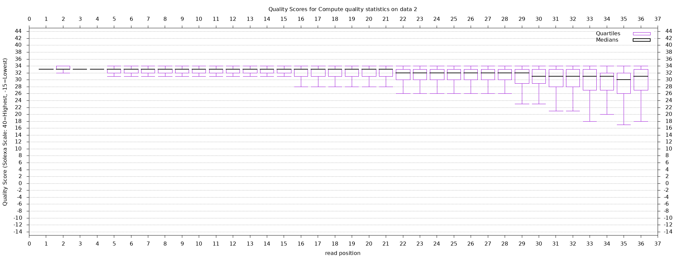
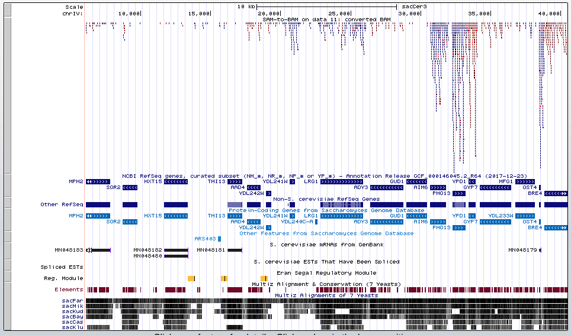

```{r setup, include=FALSE}
knitr::opts_chunk$set(echo=TRUE)
knitr::opts_knit$set(root.dir="/home/tim/Documents/GitHub/School/Statistical Genomics/hw4")
library(knitr)
library(tidyverse)
```

# 1. RNA-seq Data and QC

## a) Read information

The first entry in the .fastq file is:

`@SRR390924.1.1 COLUMBO:1:1:1:1926 length=36

AAAAAAAANAAAAAAAAAAAAAAAAAAAAAAAAAAA

+SRR390924.1.1 COLUMBO:1:1:1:1926 length=36

####################################`

The first line contains the sequence ID (after the @ symbol) and an optional description. Line 2 contains the read sequence and line 3 has the same sequence ID (this time after the + symbol) followed by another optional description. The final line encodes a quality score for each base pair (BP) in the sequence using the hexadecimal format. In this dataset, reads are 36 BP long.

For more recent Illumina systems, you can find the q-score for each BP by subtracting 33 from the ASCII code. From the q-score you can then calculate the probability that the BP call was incorrect using the formula $P=10^{\frac{-Q}{10}}$. For for the first entry in this file, $q=35-33=2$, so $P=$ `r round(10^(-2/10),3)`. This is not a high quality read.

According to the SRA entry there are 3,614,610 reads in this file. 

## b) Summary statistics

"FASTQ Summary Statistics" returns a table where each row represents a BP position within a read (in this case 1-36). For each BP position, the table includes quality summary statistics such as minimum, maximum, and mean q-score. In general the summary statistics are fairly standard and self-explanatory, but the column descriptions from the usegalaxy.org documentation are as follows:

column = column number (1 to 36 for a 36-cycles read Solexa file)

count = number of bases found in this column.

min = Lowest quality score value found in this column.

max = Highest quality score value found in this column.

sum = Sum of quality score values for this column.

mean = Mean quality score value for this column.

Q1 = 1st quartile quality score.

med = Median quality score.

Q3 = 3rd quartile quality score.

IQR = Inter-Quartile range (Q3-Q1).

lW = 'Left-Whisker' value (for boxplotting).

rW = 'Right-Whisker' value (for boxplotting).

outliers = Scores falling beyond the left and right whiskers (comma separated list).

A_Count = Count of 'A' nucleotides found in this column.

C_Count = Count of 'C' nucleotides found in this column.

G_Count = Count of 'G' nucleotides found in this column.

T_Count = Count of 'T' nucleotides found in this column.

N_Count = Count of 'N' nucleotides found in this column.

Other_Nucs = Comma separated list of other nucleotides found in this column.

Other_Count = Comma separated count of other nucleotides found in this column.

```{r fastq sum stat}
sum_stat <- read.delim("./FASTQ_Summary_Statistics.tabular")
colnames(sum_stat)[1] <- "position"
kable(head(sum_stat,5))
```

### Nucleotide content by position

```{r position plot}
plot_sum_stat <- sum_stat %>% 
  pivot_longer(cols = A_Count:N_Count)
ggplot(plot_sum_stat,aes(x=position,y=value,color=name)) +
  geom_line() +
  xlab("Read Position") + ylab("Count") + 
  scale_color_discrete(name = "Nucleotide",
                       labels=c("A","C","G","N","T")) +
  theme_bw()
```

Early on in the reads there appear to be a large number of cytosines and not many thymines. However, as the read position increases the proportions seem to stabilize and there are generally more adenosines and thymines, as one might expect. Also, there appears to be more variability early on in the reads, and it decreases as the length of the read increases.

### Quality score boxplot



As the read length increases, the quality tends to deteriorate. Based on visual inspection it seems that the drop in overall quality occurs around position 29. The variability in quality also increases as the read length increases. 

# 2. RNA-seq Mapping using Bowtie2

## a) Bowtie2 Mapping

The first two reads have the flag 16, which corresponds to "SEQ being reverse complemented" (i.e. mapped to the reverse strand). However, the third read has flag 4 which corresponds to "segment unmapped." Filtering out the unmapped reads and reads which failed quality control checks results in ~2,600,000 reads (which is about 72% of the original number of reads).

## b) Visualization of Mapping

The UCSC squish view is showing chromosome IV. Based on the RefSeq track (the one directly below our data track), there appear to be 16 yeast genes in this section of the chromosome. The genes are MPH2 through BRE4, and it appears that the genes toward the right of the visualization have the highest coverage, particularly AIM6, PHO13, and YPD1. OST4 and BRE4 also appear to have good coverage, although not quite as much as the genes between 30kbp and 35kbp.



## c) Quantitation

The htseq function returns two tables, one with a summary of the number of aligned or ambiguous reads and another with read counts for specific features (in this case gene IDs). 

```{r htseq}
# Import no features
no_feat <- read.delim("./htseq-count_no_feature.tabular",header = F)
kable(no_feat,col.names = c("Category","SAM-to-BAM on data 11: converted BAM"),
      caption = "htseq Summary Table")
# Counts per features
feat <- read.delim("./htseq-count.tabular",header = F)
kable(head(feat[order(feat$V2,decreasing = T),],10),
      caption = "htseq Top 10 Features by Read Count",
      col.names = c("Geneid","SAM-to-BAM on data 11: converted BAM"))
```
